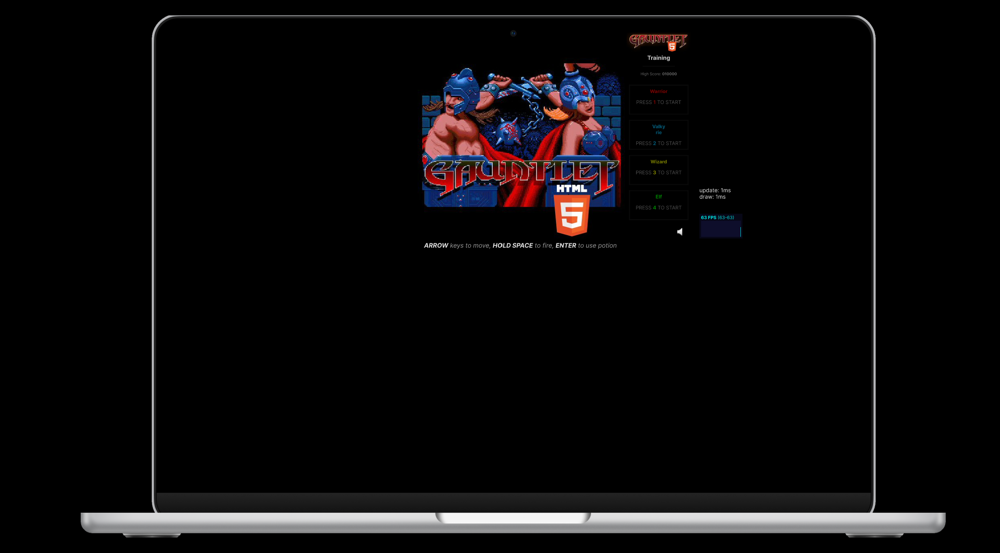
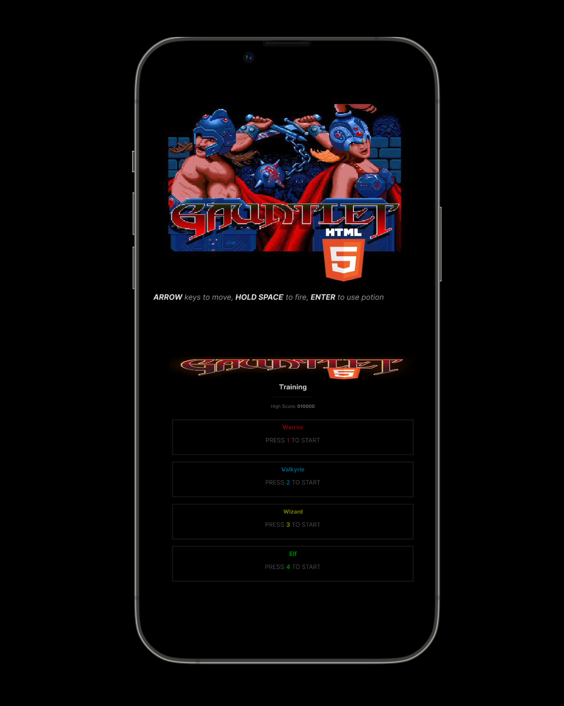

# Gauntlet Game


[](https://x.com/de_parthaa)


Gauntlet Game is an interactive and engaging game built using HTML, CSS, and JavaScript. It offers an immersive experience with dynamic gameplay mechanics.

## Demo




## Features
* Fully responsive game interface
* Smooth animations and transitions
* Interactive elements for an engaging user experience
* Lightweight and optimized for performance

## Prerequisites

Before you begin, ensure you have met the following requirements:

* [Git](https://git-scm.com/downloads "Download Git") must be installed on your operating system.
* A modern web browser (Chrome, Firefox, Edge, etc.)

## Installing vCard

To install **Gauntlet Game**, follow these steps:

Linux and macOS:

```bash
sudo git clone https://github.com/Parthadee/Gauntlet-Game.git
cd Gauntlet-Game
```

Windows:

```bash
git clone https://github.com/Parthadee/Gauntlet-Game.git
cd Gauntlet-Game
```
## How to Play
* Open the index.html file in your browser.
* Use the on-screen controls or keyboard shortcuts to interact with the game.
* Enjoy the immersive gameplay and challenge yourself!

## Contact

If you want to contact me you can reach me at [Twitter](https://x.com/de_parthaa).

## License

MIT
